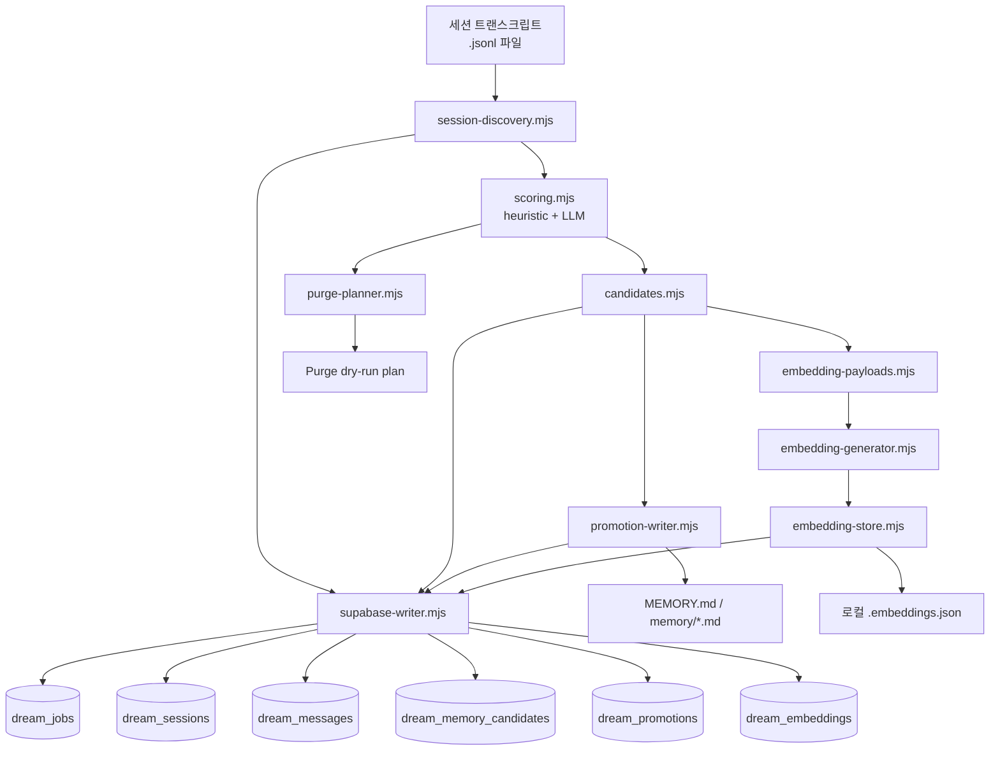
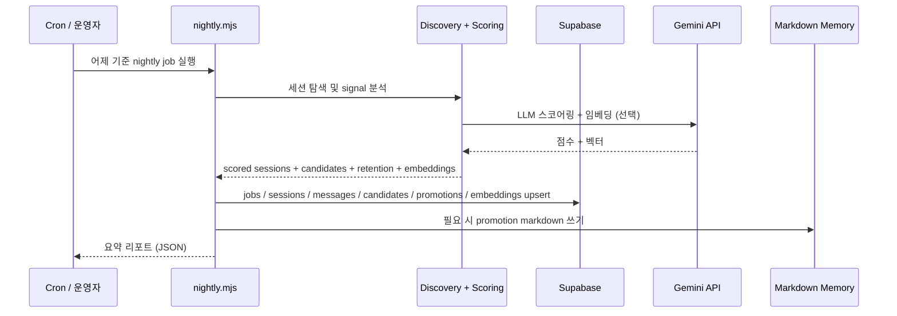

# 05_dream

[View English README](./README.md)

`05_dream`은 OpenClaw 스타일의 에이전트 시스템을 위한 실험적 **dream-memory 파이프라인**입니다.

하루치 세션/대화 기록을 바탕으로 밤마다 다음 흐름을 수행합니다:

1. 어제의 세션을 탐색하고,
2. 내용을 분석하고 점수화(heuristic + LLM 선택)한 뒤,
3. 장기 기억 후보를 추출하고,
4. 원본 세션 데이터를 Supabase에 archive하고,
5. 고신호 후보를 사람이 읽을 수 있는 Markdown memory 파일로 promotion하고,
6. 시맨틱 recall을 위한 선택적 임베딩을 생성하고,
7. retention / purge 후보를 계산합니다.

현재 상태는 의도적으로 **v0**입니다:
- batch-first
- audit-friendly
- replayable
- 완전한 지능형 판단보다 heuristic 중심
- 과한 자동화보다 운영자 제어를 우선

---

## 왜 이 프로젝트를 만들었나

많은 에이전트 메모리 시스템은 보통 셋 중 하나의 문제를 가집니다:

- 너무 많이 잊어버리거나,
- 너무 많이 기억하거나,
- 운영 로그/잡담/장기 기억을 한데 섞어버립니다.

`05_dream`은 이 문제를 보수적으로 다룹니다:

- **나중에 다시 볼 가치가 있는 원본은 먼저 archive**하고,
- **장기 기억으로 올릴 것은 더 엄격하게 선별**하고,
- **최종 기억은 사람이 읽을 수 있게 유지** (Markdown-first)하고,
- **각 단계가 추적 가능하도록 설계**합니다.

이 접근은 다음과 같은 환경에 잘 맞습니다:

- 개인 AI assistant
- 운영자 감독형 agent system
- 장기 실행되는 chat agent의 memory 실험
- nightly reflection 스타일 파이프라인

---

## 아키텍처



---

## Nightly 흐름



---

## 핵심 아이디어

### 1) archive가 먼저다
고수준 요약을 신뢰하기 전에, 원본 세션 데이터가 먼저 보존되어야 합니다.

### 2) promotion은 archive보다 더 엄격해야 한다
어떤 세션은 raw archive로는 남길 가치가 있어도, 장기 기억으로 승격할 정도는 아닐 수 있습니다.

### 3) 운영 대화가 장기 기억을 오염시키면 안 된다
cron / 자동화 / low-user-signal 세션은 archive는 하되, promotion은 강하게 제한합니다.

### 4) Markdown은 여전히 중요한 최종 출력이다
장기 기억은 `MEMORY.md`, `memory/*.md` 같은 사람이 읽을 수 있는 형식으로 남는 것을 목표로 합니다.

### 5) 선택적 임베딩, 무차별 벡터화가 아니다
고신뢰 후보와 승격된 항목만 임베딩하여, 비용을 통제하면서 시맨틱 recall을 가능하게 합니다.

---

## 저장소 구조

```text
05_dream/
├── README.md
├── README-kr.md
├── LICENSE
├── dream-memory.env.example
├── docs/
│   ├── dream-memory-system-v0.md
│   ├── dream-memory-system-v0-checklist.md
│   ├── dream-memory-system-v0-supabase.sql
│   ├── dream-memory-v1-architecture.md
│   ├── project-aware-memory-model.md
│   ├── project-aware-memory-implementation-plan.md
│   └── selective-embedding-recall-v0_5.md
├── scripts/dream-memory/
│   ├── nightly.mjs              # 메인 오케스트레이터
│   ├── e2e.mjs                  # 로컬 MVP E2E 테스트
│   ├── recall.mjs               # 시맨틱 recall 진입점
│   ├── README.md
│   ├── ENV_BRIDGE.md
│   ├── fixtures/
│   │   └── sample-report.json
│   ├── test/                    # 유닛 + 통합 테스트
│   │   ├── nightly.integration.test.mjs
│   │   ├── embedding-store.test.mjs
│   │   ├── promotion-writer.test.mjs
│   │   ├── supabase-writer.test.mjs
│   │   ├── recall-planner.test.mjs
│   │   └── ...
│   └── src/
│       ├── config.mjs                # 환경변수 + CLI 인자 파싱
│       ├── session-discovery.mjs     # JSONL 세션 파싱
│       ├── scoring.mjs               # 휴리스틱 스코어링 엔진
│       ├── llm-scorer.mjs            # Gemini API LLM 스코어링
│       ├── candidates.mjs            # 메모리 후보 추출
│       ├── embedding-payloads.mjs    # 선택적 임베딩 준비
│       ├── embedding-generator.mjs   # Gemini 임베딩 API 호출
│       ├── embedding-store.mjs       # 임베딩 영속화
│       ├── supabase-writer.mjs       # Archive + 후보 쓰기
│       ├── promotion-writer.mjs      # 멱등 Markdown 생성
│       ├── purge-planner.mjs         # 보존 정책 플래너
│       ├── recall-planner.mjs        # 쿼리 기반 메모리 검색
│       ├── semantic-retriever.mjs    # 시맨틱 recall 프로바이더 스텁
│       ├── project-detection.mjs     # 프로젝트 힌트 추론
│       ├── date-window.mjs           # 타임존 인식 날짜 범위
│       ├── memory-bootstrap.mjs      # 메모리 디렉토리 셋업
│       ├── text-cleaning.mjs         # 텍스트 전처리
│       ├── api-utils.mjs             # API 키 sanitization
│       └── vector-recall-stub.mjs    # 벡터 recall 플레이스홀더
├── supabase/
│   ├── dream_memory.sql              # 코어 스키마 (5 테이블)
│   ├── dream_memory_v1_projects.sql  # 프로젝트 인식 확장
│   └── dream_memory_v1_embeddings.sql # 임베딩 스키마
└── LICENSE
```

---

## 시작하기

### 사전 요구사항

- Node.js 16+ (ES modules)
- 선택: dream-memory 스키마가 적용된 Supabase 인스턴스
- 선택: Gemini API 키 (LLM 스코어링 및 임베딩용)

### 설정

```bash
# 예제 env 복사 후 설정
cp dream-memory.env.example .env

# 최소 설정
export DREAM_SESSIONS_DIR=/path/to/sessions
export DREAM_MEMORY_ROOT=/path/to/workspace
```

### 빠른 로컬 실행 (Supabase 불필요)

```bash
node scripts/dream-memory/e2e.mjs
```

내장된 fixture를 사용하여:
1. 선택적 임베딩 페이로드를 로컬 JSON 스냅샷으로 저장
2. 시맨틱 스텁 프로바이더로 recall planning을 엔드투엔드 실행

### 전체 nightly 파이프라인

```bash
# Dry run (분석만, 쓰기 없음)
node scripts/dream-memory/nightly.mjs --date yesterday --dry-run

# Supabase archival 포함 전체 실행
node scripts/dream-memory/nightly.mjs \
  --date 2026-03-12 \
  --dry-run=false \
  --archive=true \
  --promote=true \
  --purge=true \
  --embeddings=true

# 메모리 recall
node scripts/dream-memory/recall.mjs \
  --date 2026-03-12 \
  --query "검색 쿼리" \
  --top-k 5
```

### CLI 플래그

| 플래그 | 값 | 설명 |
|--------|------|------|
| `--date` | `YYYY-MM-DD`, `yesterday`, `today` | 대상 날짜 |
| `--dry-run` | `true`/`false` | 쓰기 없이 분석만 |
| `--archive` | `true`/`false` | Supabase에 archive |
| `--promote` | `true`/`false` | Markdown memory 파일 쓰기 |
| `--purge` | `true`/`false` | retention/purge 계획 |
| `--embeddings` | `true`/`false` | 임베딩 생성 |
| `--scorer` | `heuristic`/`llm`/`auto` | 스코어링 전략 |
| `--limit` | 숫자 | 최대 세션 수 |
| `--embedding-store` | `supabase`/`file` | 임베딩 저장 백엔드 |
| `--embedding-provider` | `gemini`/`local` | 임베딩 API 프로바이더 |

---

## 설정

### 환경변수

| 변수 | 설명 | 기본값 |
|------|------|--------|
| `DREAM_SESSIONS_DIR` | 세션 JSONL 디렉토리 | (필수) |
| `DREAM_MEMORY_ROOT` | 워크스페이스 루트 경로 | (필수) |
| `DREAM_MEMORY_TZ` | 날짜 기준 타임존 | `Asia/Seoul` |
| `DREAM_LIMIT` | 최대 세션 수 | 무제한 |
| `DREAM_SCORER_MODE` | 스코어링 전략 | `auto` |
| `GEMINI_API_KEY` | Google Gemini API 키 | (선택) |
| `DREAM_LLM_MODEL` | 스코어링용 LLM 모델 | `gemini-2.0-flash-lite` |
| `DREAM_ARCHIVE_TO_SUPABASE` | Supabase 영속화 활성화 | `false` |
| `DREAM_WRITE_PROMOTIONS` | Markdown memory 파일 쓰기 | `false` |
| `DREAM_PURGE_DRY_RUN` | purge 계획만 (삭제 안 함) | `false` |
| `DREAM_SUPABASE_URL` | Supabase 인스턴스 URL | (bridge 또는 필수) |
| `DREAM_SUPABASE_SERVICE_ROLE_KEY` | Supabase service role 키 | (bridge 또는 필수) |
| `DREAM_EMBEDDING_PROVIDER` | 임베딩 소스 | `gemini` |
| `DREAM_EMBEDDING_MODEL` | 임베딩 모델 | `text-embedding-004` |
| `DREAM_EMBEDDING_STORE` | 임베딩 저장소 | `supabase` |
| `DREAM_PERSIST_EMBEDDINGS` | 임베딩 저장 여부 | `false` |
| `DREAM_RETENTION_EPHEMERAL_DAYS` | 임시 보존 기간 | `14` |
| `DREAM_RETENTION_STANDARD_DAYS` | 표준 보존 기간 | `60` |
| `DREAM_RETENTION_PROMOTED_DAYS` | 승격 보존 기간 | `180` |

### Supabase env 브릿지

워크스페이스에 `03_supabase/.env`가 존재하면, 시스템이 `API_EXTERNAL_URL`과 `SERVICE_ROLE_KEY`를 자동으로 bridge합니다. `DREAM_SUPABASE_*`를 수동으로 설정할 필요 없습니다. 자세한 내용은 `scripts/dream-memory/ENV_BRIDGE.md`를 참조하세요.

---

## 스코어링

세션은 **heuristic + LLM 하이브리드** 전략으로 점수화됩니다.

### 휴리스틱 스코어링

패턴 기반 signal 탐지 (한국어 + 영어):

| 시그널 | 가중치 | 예시 |
|--------|--------|------|
| 명시적 기억 요청 | 25 | "기억해", "앞으로", "규칙" |
| 장기 프로젝트 신호 | 20 | 아키텍처, 정책, 운영 |
| 의사결정 | 15 | "하자", "확정", "추천" |
| 사용자 선호도 | 15 | "선호", "원해", "좋아" |
| 실행 가능한 후속 작업 | 10 | 다음 단계, 체크리스트, SQL |
| 반복 신호 | 10 | 8개 이상 메시지 |
| 참신성 | 5 | 새로운 시스템 개념 |

**억제 규칙**:
- 자동화 세션: 점수 최대 34로 제한
- 낮은 사용자 비율 (<20%): 점수 최대 49로 제한

**중요도 밴드**: critical (75+), high (50-74), medium (25-49), low (0-24)

### LLM 스코어링 (선택)

`GEMINI_API_KEY`가 설정되고 scorer 모드가 `llm` 또는 `auto`이면, Gemini를 통해 다차원 분석과 더 풍부한 신뢰도 신호로 세션을 추가 평가합니다.

---

## 메모리 후보

추출된 프래그먼트는 7가지 종류로 분류됩니다:

| 종류 | 설명 | promotion 대상 |
|------|------|---------------|
| `project_state` | 프로젝트 상태, 아키텍처 | `memory/projects/{slug}.md` |
| `user_preference` | 커뮤니케이션 스타일, 선호도 | `MEMORY.md` |
| `decision` | 확정된 의사결정 | `memory/decisions/log.md` |
| `operation_rule` | 정책, 가이드라인 | `MEMORY.md` |
| `todo` | 실행 가능한 작업 | `memory/projects/todos.md` |
| `relationship` | 사람, 팀 | `memory/people/relationships.md` |
| `fact` | 일반 정보 | `memory/inbox.md` |

### Markdown memory 구조

```text
MEMORY.md
├── Stable Preferences          (user_preference)
├── Operational Rules           (operation_rule)
├── Active Projects             (project_state)
└── Pending review              (fact)

memory/projects/{slug}.md
├── Snapshot                    (project_state)
├── Important Decisions         (decision)
└── Active Todos                (todo)

memory/decisions/log.md         (decision, 프로젝트 무관)
memory/people/relationships.md  (relationship)
memory/projects/todos.md        (todo, 프로젝트 무관)
memory/inbox.md                 (fact)
```

모든 쓰기는 HTML 주석 마커(`<!-- dream-memory:entry SLUG ... /dream-memory:entry -->`)를 사용하여 **멱등(idempotent)**합니다. 같은 내용으로 재실행하면 no-op이고, 내용이 변경되면 replace 또는 merge가 수행됩니다.

---

## 임베딩 & 시맨틱 recall

### 선택적 임베딩

고신뢰 후보와 승격된 항목만 임베딩됩니다 (세션 전체 내용이 아님). API 비용을 통제하면서 recall을 가능하게 합니다.

**지원 프로바이더**:
- `gemini` — Gemini `text-embedding-004`를 통한 실제 벡터 생성
- `local` — 테스트용 스텁 프로바이더 (API 호출 없음)

### Recall

```bash
node scripts/dream-memory/recall.mjs --query "auth middleware" --top-k 5
```

현재 구현은 **어휘 기반(lexical) 스텁** 프로바이더를 사용합니다. 향후 버전에서는 pgvector를 통합하여 하이브리드 recall을 지원할 예정입니다:
1. 메타데이터 필터 (프로젝트, 날짜, 종류)
2. 키워드/어휘 검색
3. 벡터 유사도
4. 리랭킹

---

## Supabase 스키마

### 코어 테이블 (`supabase/dream_memory.sql`)

| 테이블 | 용도 |
|--------|------|
| `dream_jobs` | Nightly job 추적 |
| `dream_sessions` | 아카이브된 세션 메타데이터 + 점수 |
| `dream_messages` | 원본 메시지 아카이브 |
| `dream_memory_candidates` | 추출된 메모리 가치 프래그먼트 |
| `dream_promotions` | 장기 기억 항목 |

### 프로젝트 인식 확장 (`supabase/dream_memory_v1_projects.sql`)

| 테이블 | 용도 |
|--------|------|
| `dream_projects` | 프로젝트 카탈로그 |
| `dream_session_projects` | 세션-프로젝트 연결 |
| `dream_candidate_projects` | 후보-프로젝트 연결 |

### 임베딩 스키마 (`supabase/dream_memory_v1_embeddings.sql`)

| 테이블 | 용도 |
|--------|------|
| `dream_embedding_documents` | 임베딩 소스 메타데이터 |
| `dream_embeddings` | 벡터 데이터 + 상태 추적 |

---

## 테스트

```bash
# 전체 테스트 실행
node --test scripts/dream-memory/test/*.test.mjs

# 로컬 MVP e2e (Supabase 불필요)
node scripts/dream-memory/e2e.mjs
```

---

## 현재 상태

### 구현 완료
- 전체 파이프라인 오케스트레이션이 포함된 nightly runner
- JSONL 트랜스크립트 파일에서 세션 탐색
- 한국어 + 영어 패턴 탐지를 통한 휴리스틱 스코어링
- Gemini API를 통한 LLM 스코어링 (선택)
- 자동화 / cron / low-user-signal 억제
- 메모리 후보 추출 (7종)
- Supabase raw archive 영속화 (멱등)
- 핑거프린트 dedup이 적용된 후보 영속화
- 멱등 Markdown promotion 쓰기
- 프로젝트 인식 세션/후보 분류
- 선택적 임베딩 생성 (Gemini)
- 임베딩 영속화 (Supabase + 로컬 파일)
- 시맨틱 recall planning (어휘 스텁)
- retention class 기반 purge dry-run 계획
- self-hosted Supabase에서 env bridge

### 아직 미완성
- production-grade promotion merge/replace 전략
- 실제 purge executor (현재 dry-run만 지원)
- 실제 벡터 기반 시맨틱 recall (pgvector)
- 대시보드 / query view
- privacy / redaction 정책 시스템
- real-time reflection / streaming memory 업데이트

---

## 로드맵

### 단기
- promotion 품질과 dedup 개선
- `dream_promotions` 활용 강화
- 더 안전한 purge execution flow 추가
- false positive 검토 툴링 개선

### 중기
- 하이브리드 recall (메타데이터 + 키워드 + 벡터)
- daily vs. canonical memory 출력 분리
- query view 또는 lightweight admin UI
- 선택적 redaction / sensitivity 정책
- 프로젝트 인식 분류 고도화
- 다른 transcript source용 adapter 확장

---

## 설계 문서

- `docs/dream-memory-system-v0.md` — v0 초기 방향
- `docs/dream-memory-v1-architecture.md` — 정제된 v1 아키텍처
- `docs/project-aware-memory-model.md` — 프로젝트 인식 세션/후보 연결
- `docs/project-aware-memory-implementation-plan.md` — 코드 수준 구현 계획
- `docs/selective-embedding-recall-v0_5.md` — 선택적 임베딩 및 recall 설계

---

## 오픈소스 포지셔닝

이 프로젝트는 다음을 원하는 사람에게 잘 맞습니다:

- 검사 가능하고 감사 추적이 가능한 memory pipeline
- 단순한 file-based transcript ingestion
- Supabase 기반 archival storage
- 보수적인 long-term memory promotion
- agent-memory 실험을 위한 기반 코드

반대로 이 프로젝트는 아직 다음을 목표로 하지 않습니다:

- 범용 vector memory framework
- full knowledge graph
- real-time autonomous reflection engine
- 완성형 end-user product

---

## 라이선스

[MIT License](./LICENSE)를 사용합니다.
