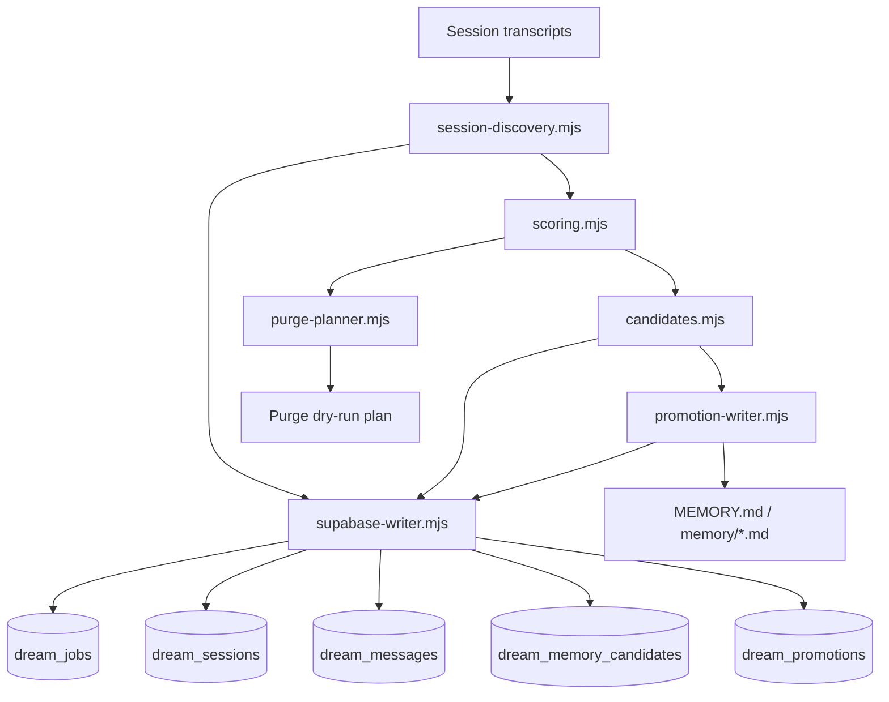
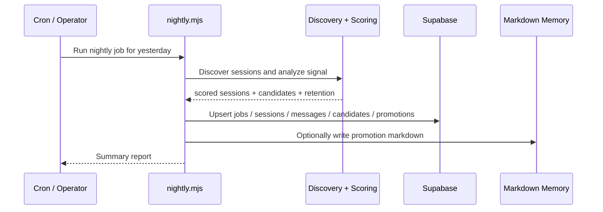

# 05_dream

[한국어 README 보기](./README-kr.md)

`05_dream` is an experimental **dream-memory pipeline** for OpenClaw-style agent systems.

It turns raw session transcripts into a nightly memory workflow:

1. discover yesterday's sessions,
2. analyze and score them,
3. archive raw session data into Supabase,
4. extract long-term memory candidates,
5. plan promotions into human-readable memory files,
6. calculate retention / purge candidates.

The current project is intentionally **v0**:
- batch-first,
- audit-friendly,
- replayable,
- heuristic rather than “fully intelligent”,
- optimized for operator control over magic.

---

## Why this exists

Most agent systems either:
- forget too much,
- remember too much,
- or mix short-term operational chatter with long-term user memory.

`05_dream` tries a different approach:

- **archive everything important enough to revisit**,
- **promote only a small, high-signal subset**,
- **keep memory human-readable**,
- **make every stage inspectable**.

This makes it suitable for:
- personal AI assistants,
- operator-supervised agent systems,
- memory experiments for long-running chat agents,
- “nightly reflection” style pipelines.

---

## Core ideas

### 1) Archive first
Raw session material should be preserved before higher-level summarization is trusted.

### 2) Promotion is stricter than archiving
A session may be worth storing in raw form without being worthy of long-term memory.

### 3) Operational chatter should not dominate memory
Cron / automation / low-user-signal sessions are archived, but heavily constrained from promotion.

### 4) Markdown remains a first-class output
Long-term memory is still meant to end up in readable files such as `MEMORY.md` and `memory/*.md`.

---

## Architecture



---

## Nightly flow



---

## Repository structure

```text
05_dream/
├─ README.md
├─ dream-memory.env.example
├─ docs/
│  ├─ dream-memory-system-v0.md
│  ├─ dream-memory-system-v0-checklist.md
│  └─ dream-memory-system-v0-supabase.sql
├─ scripts/
│  └─ dream-memory/
│     ├─ README.md
│     ├─ ENV_BRIDGE.md
│     ├─ nightly.mjs
│     └─ src/
│        ├─ candidates.mjs
│        ├─ config.mjs
│        ├─ date-window.mjs
│        ├─ memory-bootstrap.mjs
│        ├─ promotion-writer.mjs
│        ├─ purge-planner.mjs
│        ├─ scoring.mjs
│        ├─ session-discovery.mjs
│        ├─ supabase-writer.mjs
│        └─ text-cleaning.mjs
├─ supabase/
│  └─ dream_memory.sql
└─ LICENSE
```

---

## Current capabilities

### Implemented
- nightly runner (`nightly.mjs`)
- session discovery from transcript files
- heuristic scoring and importance banding
- automation / cron / low-user-signal suppression
- candidate extraction
- Supabase raw archive persistence
- candidate persistence to `dream_memory_candidates`
- promotion planning / markdown generation path
- purge dry-run planning
- OpenClaw cron validation

### Validated
- archive persistence into Supabase works
- candidate persistence works
- cron-triggered nightly runs work
- archive fallback via `03_supabase/.env`-style bridge works

### Not finished yet
- production-grade promotion merge/replace strategy
- real purge executor (currently dry-run only)
- polished dashboards / query views
- broader privacy / redaction policy system
- real-time reflection or streaming memory updates

---

## Supabase schema

The project expects these tables:
- `dream_jobs`
- `dream_sessions`
- `dream_messages`
- `dream_memory_candidates`
- `dream_promotions`

A draft schema is included in:
- `supabase/dream_memory.sql`

For self-hosted Supabase env bridging, see:
- `scripts/dream-memory/ENV_BRIDGE.md`

---

## Running locally

### Basic run

```bash
node scripts/dream-memory/nightly.mjs --date yesterday --dry-run=false --archive=true --purge=true
```

### Example flags

```bash
node scripts/dream-memory/nightly.mjs \
  --date 2026-03-12 \
  --dry-run=false \
  --archive=true \
  --promote=false \
  --purge=true \
  --limit 10
```

### Important env

```bash
DREAM_SUPABASE_URL=...
DREAM_SUPABASE_SERVICE_ROLE_KEY=...
DREAM_ARCHIVE_TO_SUPABASE=true
DREAM_WRITE_PROMOTIONS=false
DREAM_PURGE_DRY_RUN=true
```

If those env vars are not explicitly present, the current implementation can also bridge from an existing self-hosted Supabase `.env` layout.

---

## Open source positioning

This project is a good fit for people who want:
- an inspectable memory pipeline,
- simple file-based transcript ingestion,
- Supabase-backed archival storage,
- conservative long-term memory promotion,
- a foundation for agent-memory experimentation.

It is **not** trying to be:
- a universal vector memory framework,
- a full knowledge graph,
- a real-time autonomous reflection engine,
- a polished end-user product yet.

---

## Design documents

- `docs/dream-memory-system-v0.md` — original v0 direction
- `docs/dream-memory-v1-architecture.md` — refined v1 architecture based on the broader long-term memory philosophy

---

## Roadmap

### Near term
- improve promotion quality and dedupe
- implement `dream_promotions` usage more fully
- add safer purge execution flow
- add better review tooling around false positives

### Medium term
- memory merge / replace strategies
- query views or lightweight admin UI
- optional redaction / sensitivity policies
- more reusable adapters for other transcript sources

---

## Development notes

This repository currently contains:
- design docs,
- working prototype code,
- draft schema,
- contributor-facing project context.

---

## License / status

Licensed under the MIT License.

The next good cleanup step is adding roadmap issues / project boards and improving contributor-facing docs.
