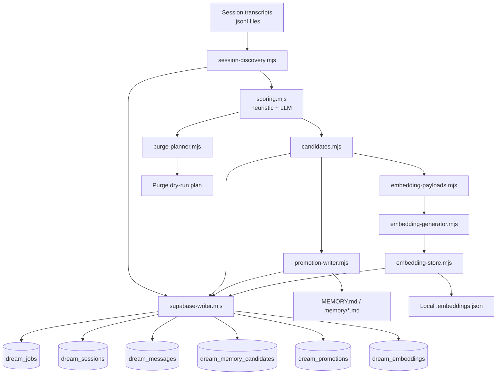
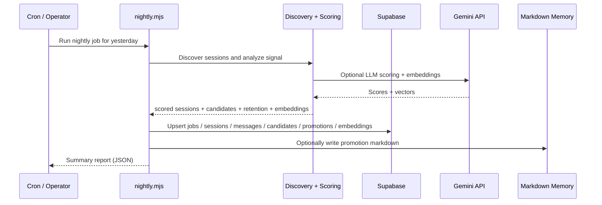

# 05_dream

[한국어 README 보기](./README-kr.md)

`05_dream` is an experimental **dream-memory pipeline** for OpenClaw-style agent systems.

It turns raw session transcripts into a nightly memory workflow:

1. discover yesterday's sessions,
2. analyze and score them (heuristic + optional LLM),
3. extract long-term memory candidates,
4. archive raw session data into Supabase,
5. promote high-signal candidates into human-readable Markdown memory files,
6. generate selective embeddings for semantic recall,
7. calculate retention / purge candidates.

The current project is intentionally **v0**:
- batch-first,
- audit-friendly,
- replayable,
- heuristic rather than "fully intelligent",
- optimized for operator control over magic.

---

## Why this exists

Most agent systems either:
- forget too much,
- remember too much,
- or mix short-term operational chatter with long-term user memory.

`05_dream` tries a different approach:

- **archive everything important enough to revisit**,
- **promote only a small, high-signal subset**,
- **keep memory human-readable** (Markdown-first),
- **make every stage inspectable**.

This makes it suitable for:
- personal AI assistants,
- operator-supervised agent systems,
- memory experiments for long-running chat agents,
- "nightly reflection" style pipelines.

---

## Architecture



---

## Nightly flow



---

## Core ideas

### 1) Archive first
Raw session material should be preserved before higher-level summarization is trusted.

### 2) Promotion is stricter than archiving
A session may be worth storing in raw form without being worthy of long-term memory.

### 3) Operational chatter should not dominate memory
Cron / automation / low-user-signal sessions are archived, but heavily constrained from promotion.

### 4) Markdown remains a first-class output
Long-term memory is meant to end up in readable files such as `MEMORY.md` and `memory/*.md`.

### 5) Selective embedding, not blanket vectorization
Only high-confidence candidates and promoted entries are embedded, keeping costs under control while enabling semantic recall.

---

## Repository structure

```text
05_dream/
├── README.md
├── README-kr.md
├── LICENSE
├── dream-memory.env.example
├── docs/
│   ├── dream-memory-system-v0.md
│   ├── dream-memory-system-v0-checklist.md
│   ├── dream-memory-system-v0-supabase.sql
│   ├── dream-memory-v1-architecture.md
│   ├── project-aware-memory-model.md
│   ├── project-aware-memory-implementation-plan.md
│   └── selective-embedding-recall-v0_5.md
├── scripts/dream-memory/
│   ├── nightly.mjs              # Main orchestrator
│   ├── e2e.mjs                  # Local MVP end-to-end test
│   ├── recall.mjs               # Semantic recall entry point
│   ├── README.md
│   ├── ENV_BRIDGE.md
│   ├── fixtures/
│   │   └── sample-report.json
│   ├── test/                    # Unit + integration tests
│   │   ├── nightly.integration.test.mjs
│   │   ├── embedding-store.test.mjs
│   │   ├── promotion-writer.test.mjs
│   │   ├── supabase-writer.test.mjs
│   │   ├── recall-planner.test.mjs
│   │   └── ...
│   └── src/
│       ├── config.mjs                # Env + CLI arg parsing
│       ├── session-discovery.mjs     # JSONL session parsing
│       ├── scoring.mjs               # Heuristic scoring engine
│       ├── llm-scorer.mjs            # Gemini API LLM scoring
│       ├── candidates.mjs            # Memory candidate extraction
│       ├── embedding-payloads.mjs    # Selective embedding prep
│       ├── embedding-generator.mjs   # Gemini embedding API calls
│       ├── embedding-store.mjs       # Embedding persistence
│       ├── supabase-writer.mjs       # Archive + candidate writes
│       ├── promotion-writer.mjs      # Idempotent Markdown generation
│       ├── purge-planner.mjs         # Retention policy planner
│       ├── recall-planner.mjs        # Query-based memory retrieval
│       ├── semantic-retriever.mjs    # Semantic recall provider stub
│       ├── project-detection.mjs     # Project hint inference
│       ├── date-window.mjs           # Timezone-aware date ranges
│       ├── memory-bootstrap.mjs      # Memory directory setup
│       ├── text-cleaning.mjs         # Text preprocessing
│       ├── api-utils.mjs             # API key sanitization
│       └── vector-recall-stub.mjs    # Vector recall placeholder
├── supabase/
│   ├── dream_memory.sql              # Core schema (5 tables)
│   ├── dream_memory_v1_projects.sql  # Project-aware extension
│   └── dream_memory_v1_embeddings.sql # Embedding schema
└── LICENSE
```

---

## Getting started

### Prerequisites

- Node.js 16+ (ES modules)
- Optional: Supabase instance with the dream-memory schema applied
- Optional: Gemini API key (for LLM scoring and embeddings)

### Setup

```bash
# Copy example env and configure
cp dream-memory.env.example .env

# Minimal config
export DREAM_SESSIONS_DIR=/path/to/sessions
export DREAM_MEMORY_ROOT=/path/to/workspace
```

### Quick local run (no Supabase required)

```bash
node scripts/dream-memory/e2e.mjs
```

This runs against a checked-in fixture:
1. persists selective embedding payloads into a local JSON snapshot
2. runs recall planning with the semantic stub provider end-to-end

### Full nightly pipeline

```bash
# Dry run (analyze only, no writes)
node scripts/dream-memory/nightly.mjs --date yesterday --dry-run

# Full run with Supabase archival
node scripts/dream-memory/nightly.mjs \
  --date 2026-03-12 \
  --dry-run=false \
  --archive=true \
  --promote=true \
  --purge=true \
  --embeddings=true

# Memory recall
node scripts/dream-memory/recall.mjs \
  --date 2026-03-12 \
  --query "search query" \
  --top-k 5
```

### CLI flags

| Flag | Values | Description |
|------|--------|-------------|
| `--date` | `YYYY-MM-DD`, `yesterday`, `today` | Target date |
| `--dry-run` | `true`/`false` | Analyze without writing |
| `--archive` | `true`/`false` | Archive to Supabase |
| `--promote` | `true`/`false` | Write Markdown memory files |
| `--purge` | `true`/`false` | Plan retention/purge |
| `--embeddings` | `true`/`false` | Generate embeddings |
| `--scorer` | `heuristic`/`llm`/`auto` | Scoring strategy |
| `--limit` | number | Max sessions per run |
| `--embedding-store` | `supabase`/`file` | Embedding storage backend |
| `--embedding-provider` | `gemini`/`local` | Embedding API provider |

---

## Configuration

### Environment variables

| Variable | Description | Default |
|----------|-------------|---------|
| `DREAM_SESSIONS_DIR` | Session JSONL directory | (required) |
| `DREAM_MEMORY_ROOT` | Workspace root path | (required) |
| `DREAM_MEMORY_TZ` | Timezone for date windowing | `Asia/Seoul` |
| `DREAM_LIMIT` | Max sessions per run | unlimited |
| `DREAM_SCORER_MODE` | Scoring strategy | `auto` |
| `GEMINI_API_KEY` | Google Gemini API key | (optional) |
| `DREAM_LLM_MODEL` | LLM model for scoring | `gemini-2.0-flash-lite` |
| `DREAM_ARCHIVE_TO_SUPABASE` | Enable Supabase persistence | `false` |
| `DREAM_WRITE_PROMOTIONS` | Write Markdown memory files | `false` |
| `DREAM_PURGE_DRY_RUN` | Purge planning only | `false` |
| `DREAM_SUPABASE_URL` | Supabase instance URL | (bridged or required) |
| `DREAM_SUPABASE_SERVICE_ROLE_KEY` | Supabase service role key | (bridged or required) |
| `DREAM_EMBEDDING_PROVIDER` | Embedding source | `gemini` |
| `DREAM_EMBEDDING_MODEL` | Embedding model | `text-embedding-004` |
| `DREAM_EMBEDDING_STORE` | Embedding storage | `supabase` |
| `DREAM_PERSIST_EMBEDDINGS` | Save embeddings | `false` |
| `DREAM_RETENTION_EPHEMERAL_DAYS` | Ephemeral retention | `14` |
| `DREAM_RETENTION_STANDARD_DAYS` | Standard retention | `60` |
| `DREAM_RETENTION_PROMOTED_DAYS` | Promoted retention | `180` |

### Supabase env bridging

If `03_supabase/.env` exists in the workspace, the system auto-bridges `API_EXTERNAL_URL` and `SERVICE_ROLE_KEY` so you don't need to set `DREAM_SUPABASE_*` manually. See `scripts/dream-memory/ENV_BRIDGE.md` for details.

---

## Scoring

Sessions are scored via a **hybrid heuristic + LLM strategy**.

### Heuristic scoring

Pattern-based signal detection (Korean + English):

| Signal | Weight | Examples |
|--------|--------|---------|
| Explicit memory | 25 | "remember this", "from now on" |
| Long-term project | 20 | architecture, policy, operation |
| Decision | 15 | "let's do", "confirmed", "recommend" |
| User preference | 15 | "I prefer", "I like" |
| Actionable followup | 10 | next steps, checklist, SQL |
| Recurrence | 10 | 8+ messages in session |
| Novelty | 5 | novel system concepts |

**Suppression rules**:
- Automation sessions capped at score 34
- Low user ratio (<20%) capped at score 49

**Importance bands**: critical (75+), high (50-74), medium (25-49), low (0-24)

### LLM scoring (optional)

When `GEMINI_API_KEY` is set and scorer mode is `llm` or `auto`, sessions are also scored via Gemini for multi-dimensional analysis with richer confidence signals.

---

## Memory candidates

Extracted fragments fall into 7 kinds:

| Kind | Description | Promotion target |
|------|-------------|-----------------|
| `project_state` | Project status, architecture | `memory/projects/{slug}.md` |
| `user_preference` | Communication style, preferences | `MEMORY.md` |
| `decision` | Confirmed decisions | `memory/decisions/log.md` |
| `operation_rule` | Policies, guidelines | `MEMORY.md` |
| `todo` | Actionable tasks | `memory/projects/todos.md` |
| `relationship` | People, teams | `memory/people/relationships.md` |
| `fact` | General information | `memory/inbox.md` |

### Markdown memory structure

```text
MEMORY.md
├── Stable Preferences          (user_preference)
├── Operational Rules           (operation_rule)
├── Active Projects             (project_state)
└── Pending review              (fact)

memory/projects/{slug}.md
├── Snapshot                    (project_state)
├── Important Decisions         (decision)
└── Active Todos                (todo)

memory/decisions/log.md         (decision, non-project)
memory/people/relationships.md  (relationship)
memory/projects/todos.md        (todo, non-project)
memory/inbox.md                 (fact)
```

All writes are **idempotent** using HTML comment markers (`<!-- dream-memory:entry SLUG ... /dream-memory:entry -->`). Re-runs with the same content are no-ops; changed content triggers a replace or merge.

---

## Embeddings & semantic recall

### Selective embedding

Only high-confidence candidates and promoted entries are embedded (not all session content). This controls API costs while enabling recall.

**Supported providers**:
- `gemini` — real vector generation via Gemini `text-embedding-004`
- `local` — stub provider for testing (no API calls)

### Recall

```bash
node scripts/dream-memory/recall.mjs --query "auth middleware" --top-k 5
```

Current implementation uses a **lexical stub** provider. Future versions will integrate pgvector for hybrid recall:
1. Metadata filters (project, date, kind)
2. Keyword/lexical retrieval
3. Vector similarity
4. Re-ranking

---

## Supabase schema

### Core tables (`supabase/dream_memory.sql`)

| Table | Purpose |
|-------|---------|
| `dream_jobs` | Nightly job tracking |
| `dream_sessions` | Archived session metadata + scores |
| `dream_messages` | Raw message archive |
| `dream_memory_candidates` | Extracted memory-worthy fragments |
| `dream_promotions` | Long-term memory entries |

### Project-aware extension (`supabase/dream_memory_v1_projects.sql`)

| Table | Purpose |
|-------|---------|
| `dream_projects` | Project catalog |
| `dream_session_projects` | Session-project links |
| `dream_candidate_projects` | Candidate-project links |

### Embedding schema (`supabase/dream_memory_v1_embeddings.sql`)

| Table | Purpose |
|-------|---------|
| `dream_embedding_documents` | Embedding source metadata |
| `dream_embeddings` | Vector data + status tracking |

---

## Testing

```bash
# Run all tests
node --test scripts/dream-memory/test/*.test.mjs

# Local MVP e2e (no Supabase)
node scripts/dream-memory/e2e.mjs
```

---

## Current status

### Implemented
- Nightly runner with full pipeline orchestration
- Session discovery from JSONL transcript files
- Heuristic scoring with Korean + English pattern detection
- LLM scoring via Gemini API (optional)
- Automation / cron / low-user-signal suppression
- Memory candidate extraction (7 kinds)
- Supabase raw archive persistence (idempotent)
- Candidate persistence with fingerprint dedup
- Idempotent Markdown promotion writing
- Project-aware session/candidate classification
- Selective embedding generation (Gemini)
- Embedding persistence (Supabase + local file)
- Semantic recall planning (lexical stub)
- Purge dry-run planning with retention classes
- Env bridging from self-hosted Supabase

### Not finished yet
- Production-grade promotion merge/replace strategy
- Real purge executor (currently dry-run only)
- Real vector-based semantic recall (pgvector)
- Polished dashboards / query views
- Privacy / redaction policy system
- Real-time reflection or streaming memory updates

---

## Roadmap

### Near term
- Improve promotion quality and dedup
- Implement `dream_promotions` usage more fully
- Add safer purge execution flow
- Better review tooling around false positives

### Medium term
- Hybrid recall (metadata + keyword + vector)
- Split daily vs. canonical memory outputs
- Query views or lightweight admin UI
- Optional redaction / sensitivity policies
- Broader project-aware classification
- More reusable adapters for other transcript sources

---

## Design documents

- `docs/dream-memory-system-v0.md` — original v0 direction
- `docs/dream-memory-v1-architecture.md` — refined v1 architecture
- `docs/project-aware-memory-model.md` — project-aware session/candidate linking
- `docs/project-aware-memory-implementation-plan.md` — code-level rollout plan
- `docs/selective-embedding-recall-v0_5.md` — selective embedding and recall design

---

## Open source positioning

This project is a good fit for people who want:
- an inspectable, auditable memory pipeline,
- simple file-based transcript ingestion,
- Supabase-backed archival storage,
- conservative long-term memory promotion,
- a foundation for agent-memory experimentation.

It is **not** trying to be:
- a universal vector memory framework,
- a full knowledge graph,
- a real-time autonomous reflection engine,
- a polished end-user product (yet).

---

## License

Licensed under the [MIT License](./LICENSE).
