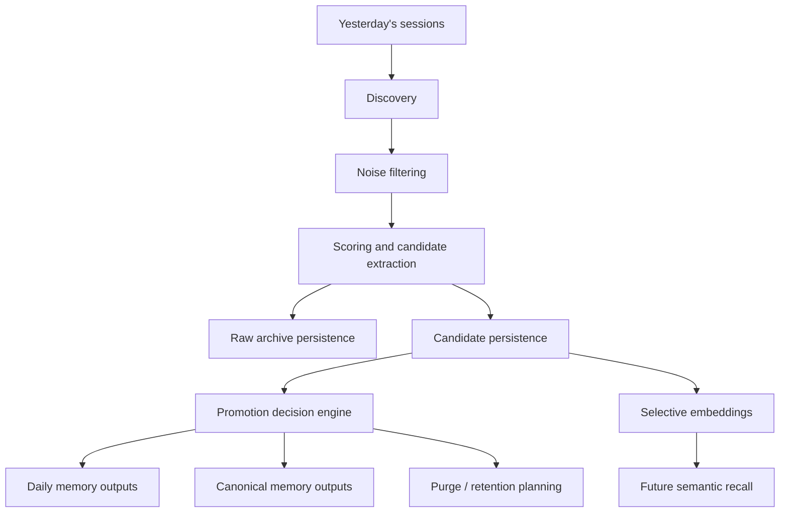
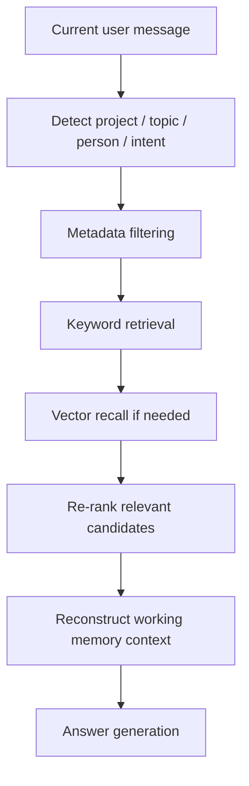

# Dream Memory v1 Architecture

This document refines the original dream-memory idea into a more implementation-friendly v1 architecture.

The core philosophy remains the same:
- collect the day,
- sleep on it,
- preserve what matters,
- strengthen stable memory,
- recall the right thing later.

The main refinement is that the system should be **layered and selective**, not simply “embed almost everything”.

---

## Design goals

1. Preserve raw context without losing auditability.
2. Prevent operational chatter from polluting long-term memory.
3. Promote only stable, high-signal memory into long-term forms.
4. Support future semantic recall without making embeddings the only retrieval path.
5. Keep memory understandable by humans, not only machines.

---

## Recommended memory layers

### 1) Raw Archive
Purpose:
- immutable or near-immutable storage of discovered sessions and messages
- audit / replay / debugging / recovery

Characteristics:
- broad capture
- relational metadata
- not all content needs embeddings

Storage examples:
- `dream_jobs`
- `dream_sessions`
- `dream_messages`

### 2) Candidate Memory
Purpose:
- store memory-worthy fragments extracted from sessions
- act as the staging area between raw archive and long-term memory

Characteristics:
- selective
- scored
- reviewable
- may be embedded for recall

Storage examples:
- `dream_memory_candidates`
- future chunk / embedding tables

### 3) Canonical Memory
Purpose:
- keep stable long-term knowledge that should survive across days

Characteristics:
- durable
- deduplicated
- structured by project / person / rule / preference / state
- human-readable markdown plus relational tracking

Examples:
- project rules
- user preferences
- ongoing project state
- recurring decisions

### 4) Recall Context
Purpose:
- reconstruct the most relevant memory for the current conversation

Characteristics:
- temporary
- query-driven
- assembled from metadata, keywords, and semantic recall

This layer should not necessarily be persisted as long-term memory itself.

---

## Key improvements over the rough initial draft

### A. Archive widely, embed selectively
Instead of embedding nearly everything except trivial conversations, use a stricter funnel:

- discard obvious noise
- archive broad raw context
- embed only promising candidates or promoted memory units

Why:
- lower cost
- less retrieval noise
- better memory quality
- easier auditability

### B. Use hybrid retrieval, not vector-only retrieval
Recommended recall order:

1. metadata filters
2. keyword / lexical retrieval
3. vector similarity
4. re-ranking / reconstruction

Why:
- project names, issue numbers, filenames, and explicit rules often work better through metadata and keyword retrieval than pure vector search.

### C. Use time as a signal, not the only signal
A memory should not become long-term only because two weeks passed.

Recommended promotion signals:
- high importance
- repeated appearance across days
- actual reuse during recall
- connected to user preference / decision / rule / project state

Recommended demotion / expiry signals:
- no reuse
- weak user relevance
- operational-only chatter
- stale transient context

### D. Separate daily memory from canonical memory
Instead of relying only on date-partitioned notes such as `memory-YYYY-MM-DD-part.md`, split memory outputs into two families:

#### Daily memory
Examples:
- `memory/daily/2026-03-13-coding.md`
- `memory/daily/2026-03-13-personal.md`

Use for:
- nightly summaries
- short-lived reflections
- observation logs

#### Canonical memory
Examples:
- `memory/projects/05_dream.md`
- `memory/people/bini.md`
- `memory/rules/openclaw-ops.md`

Use for:
- durable user preferences
- stable project rules
- long-running decisions
- consolidated project state

---

## Recommended nightly pipeline

---

## Recommended recall pipeline

---

## Suggested data model extensions

### Current base
- `dream_jobs`
- `dream_sessions`
- `dream_messages`
- `dream_memory_candidates`
- `dream_promotions`

### Recommended future additions
- `dream_projects`
- `dream_session_projects`
- `dream_embeddings`
- `dream_memory_entries`
- `dream_memory_entry_links`
- `dream_memory_recall_events`

### Why these help
- `dream_projects`: explicit project-level grouping
- `dream_session_projects`: many-to-many linkage between sessions and projects
- `dream_embeddings`: separate semantic index instead of bloating core tables
- `dream_memory_entries`: canonical long-term memory units
- `dream_memory_entry_links`: relationships between memories, sessions, people, and projects
- `dream_memory_recall_events`: measure which memories are actually useful in practice

---

## Memory lifecycle proposal

Recommended states:

- `raw`
- `candidate`
- `stable`
- `long_term`
- `expired`

Example interpretation:
- `raw`: archived source material only
- `candidate`: extracted, scored, not yet trusted
- `stable`: repeatedly observed or manually confirmed
- `long_term`: durable memory worth recurring reuse
- `expired`: no longer useful for recall, kept only if needed for audit/history

Promotion should depend on multiple signals, not just age.

---

## Implementation guidance

### v1 priorities
1. add project-aware classification and linking
2. add selective embeddings for candidates / promoted memory
3. split daily vs canonical markdown outputs
4. add memory strength / reuse signals
5. implement hybrid recall path

### Important anti-goals
- do not embed every message by default
- do not merge operational logs directly into long-term memory
- do not rely on vector retrieval alone
- do not assume time elapsed automatically means memory importance

---

## Practical summary

The better implementation of the original philosophy is:

- **archive broadly**,
- **score and extract selectively**,
- **embed only where it helps**,
- **promote conservatively**,
- **separate daily reflection from canonical long-term memory**,
- **use hybrid recall rather than vector-only recall**.

This keeps the “dream” metaphor intact while making the system more practical, cheaper, and more reliable.
